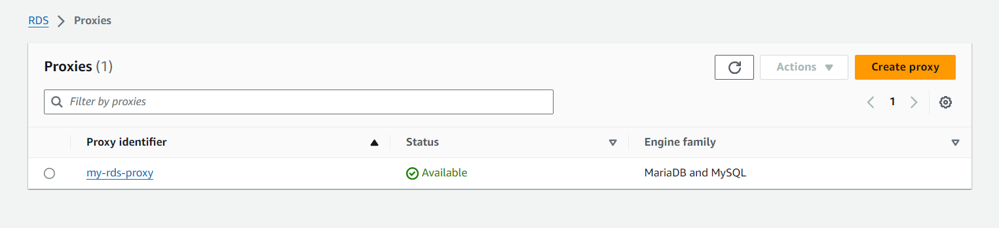

# Leveraging RDS Proxy for Centralized Database Access with Terraform

## Introduction
Amazon RDS (Relational Database Service) is an AWS-managed database service that facilitates deploying database instances in the cloud. However, managing client connections can be complex, especially to ensure high availability. This is why AWS offers RDS Proxy, a fully managed proxy service that centralizes connections to RDS instances.
In this article, we will see how to provision and configure RDS Proxy using Terraform. We will associate RDS Proxy with RDS instances and learn how to securely connect to it from applications. Using Terraform will greatly simplify deployment across different environments.


## Prerequisites

Before we dive into provisioning and configuring AWS RDS Proxy with Terraform, you'll need to have the following prerequisites in place:

1. **AWS Account**: An AWS account to access and use AWS services.
2. **AWS CLI**: The AWS Command Line Interface installed and configured.  
3. **Terraform**: Terraform installed and accessible from your system's PATH.
4. **Terraform Modules Knowledge**: Familiarity with Terraform modules is essential. If you're new to Terraform modules, I recommend reading my article [Demystifying Terraform Modules](https://blog.kemanedonfack.com/demystifying-terraform-modules/) to get up to speed.

## Understanding RDS Proxy

### What is RDS Proxy?

AWS RDS Proxy is a fully managed, highly available database proxy service that sits between your applications and Amazon Relational Database Service (RDS) instances. It serves as a centralized access point for database connections, acting as an intermediary between your applications and the underlying RDS instances.

### How RDS Proxy Works

RDS Proxy establishes a persistent connection to your RDS instances and efficiently manages the pooling and sharing of these database connections across multiple applications. Applications communicate with RDS Proxy instead of connecting directly to the database instances, allowing RDS Proxy to handle connection management and routing transparently.

When an application needs to connect to the database, it establishes a connection with RDS Proxy. RDS Proxy then establishes a separate connection to the RDS instance and passes queries back and forth between the application and the database. This architecture allows RDS Proxy to manage the connection pool efficiently, reducing the overhead of creating and terminating database connections.

### Key Features and Benefits

- **Connection Pooling**: RDS Proxy maintains a pool of database connections, reducing the overhead of establishing new connections for each application request.
- **Improved Performance**: By reusing existing connections and reducing the overhead of connection setup, RDS Proxy can improve overall application performance.
- **Centralized Access Control**: RDS Proxy acts as a single entry point for database connections, simplifying access control and security management.
- **Compatibility**: RDS Proxy works seamlessly with a variety of database engines supported by Amazon RDS, including MySQL, PostgreSQL, and Amazon Aurora.

### Use Cases for Centralized Database Access

RDS Proxy is particularly useful in scenarios where you have multiple applications or microservices connecting to the same set of RDS instances. By centralizing database access through RDS Proxy, you can:

- **Simplify Connection Management**: Instead of each application managing its own database connections, RDS Proxy handles connection pooling and load balancing.
- **Enhance Security**: You can control access to your RDS instances through a single entry point, making it easier to implement security policies and auditing.
- **Scale Efficiently**: By sharing a pool of connections across multiple applications, RDS Proxy can help you scale your infrastructure more efficiently.

## Setting up the Infrastructure with Terraform

Before we can provision and configure RDS Proxy, we need to set up the underlying infrastructure components using Terraform. Let's start by creating two Terraform configuration files: `provider.tf` and `network.tf`.

### `provider.tf`

```hcl
provider "aws" {
  region = "eu-north-1"
}

terraform {
  required_providers {
    aws = {
      source = "hashicorp/aws"
    }
  }
}
```

In the `provider.tf` file, we specify the AWS provider and the region where we want to create our infrastructure. 

### `network.tf`

```hcl
data "aws_vpc" "infrastructure_vpc" {
  id = "vpc-xxxxxxxx"
}

data "aws_subnet" "first_subnet" {
  id = "subnet-xxxxxxx"
}

data "aws_subnet" "second_subnet" {
  id = "subnet-xxxxxxxx"
}
```

In the `network.tf` file, we're using the `aws_vpc` and `aws_subnet` data sources to reference an existing Virtual Private Cloud (VPC) and two subnets within that VPC.

You'll need to replace the `id` values in the `aws_vpc` and `aws_subnet` blocks with the actual IDs of your VPC and subnets.

## Setting Up the RDS Database with Terraform

In this section, we'll create the necessary resources for our RDS database instance using Terraform.

### Creating the Database Security Group

```hcl
module "db_security_group" {
  source  = "terraform-aws-modules/security-group/aws"
  name    = "MySQL Database security group"
  description = "Security group for MySQL" 
  vpc_id  = data.aws_vpc.infrastructure_vpc.id

  ingress_with_cidr_blocks = [
    {
      from_port   = 3306
      to_port     = 3306
      protocol    = "tcp"
      description = ""
      cidr_blocks = "0.0.0.0/0"
    }
  ]

  egress_with_cidr_blocks = [
    {
      from_port   = 0
      to_port     = 0
      protocol    = "-1" 
      description = ""
      cidr_blocks = "0.0.0.0/0"
    }
  ]
}
```

We begin by creating a security group for our MySQL database instance using the `terraform-aws-modules/security-group/aws` module. The security group allows inbound traffic on port 3306 (the default MySQL port) from any IP address (`0.0.0.0/0`). It also allows all outbound traffic.

While opening port 3306 to all IP addresses is convenient for this example, in a production environment, you should restrict access to trusted IP addresses.

### Creating the Database Subnet Group

```hcl
resource "aws_db_subnet_group" "database_subnet" {
  name       = "db-group-demo"
  subnet_ids = [data.aws_subnet.first_subnet.id, data.aws_subnet.second_subnet.id]
}
```

Next, we create a database subnet group named `db-group-demo` using the two subnets specified previously in the `network.tf` file. This subnet group will be used to deploy the RDS database instances within specific subnets of your VPC, ensuring network isolation and high availability.

### Creating the RDS Database Instance

In the following section, we'll define the RDS database instance using the `terraform-aws-modules/rds/aws` module. The module configuration will include details such as the database engine, instance class, storage allocation, and other settings specific to your requirements.

```hcl
module "db" {
  source = "terraform-aws-modules/rds/aws"

  identifier           = "mydb"
  engine               = "mysql"
  engine_version       = "8.0"
  family               = "mysql8.0" # DB parameter group
  major_engine_version = "8.0"      # DB option group
  instance_class       = "db.t3.micro"

  allocated_storage     = 20
  max_allocated_storage = 100

  db_name  = "aws"
  username = "admin"
  password = "DB-Pass01"
  port     = 3306

  multi_az               = false
  db_subnet_group_name   = aws_db_subnet_group.database_subnet.name
  vpc_security_group_ids = [module.db_security_group.security_group_id]

  enabled_cloudwatch_logs_exports = ["general"]
  create_cloudwatch_log_group     = true

  skip_final_snapshot = true
  deletion_protection = false

  performance_insights_enabled          = false
  performance_insights_retention_period = 7
  create_monitoring_role                = true
  monitoring_interval                   = 60
}
```

## 5. Integrating RDS Proxy with Terraform

Now that we have set up the underlying infrastructure components using Terraform, we can proceed to integrate AWS RDS Proxy into our configuration.

### Defining the RDS Proxy Resource

```hcl
module "rds_proxy" {
  source  = "terraform-aws-modules/rds-proxy/aws"
  name    = "rds-proxy"
  iam_role_name = "rds-proxy-role"
  vpc_subnet_ids = [data.aws_subnet.first_subnet.id, data.aws_subnet.second_subnet.id]
  vpc_security_group_ids = [module.db_security_group.security_group_id]

  auth = {
    "admin" = {
      description = "RDS MySQL superuser password"
      secret_arn  = module.secrets_manager.secret_arn
    }
  }

  engine_family = "MYSQL"
  debug_logging = true

  target_db_instance = true
  db_instance_identifier = module.db.db_instance_identifier

  tags = {
    Terraform   = "true"
    Environment = "dev"
  }
}
```

In this block, we define the RDS Proxy resource using the `terraform-aws-modules/rds-proxy/aws` module. 

### Integrating AWS Secrets Manager

```hcl
module "secrets_manager" {
  source  = "terraform-aws-modules/secrets-manager/aws"
  name_prefix             = "example"
  description             = "Example Secrets Manager secret"
  recovery_window_in_days = 30
  create_policy           = true
  block_public_policy     = true

  policy_statements = {
    read = {
      sid       = "AllowAccountRead"
      principals = [{ type = "AWS", identifiers = ["arn:aws:iam::625243961866:root"] }]
      actions   = ["secretsmanager:GetSecretValue"]
      resources = ["*"]
    }
  }

  secret_string = jsonencode({
    username = "admin"
    password = "DB-Pass01"
  })

  tags = {
    Environment = "Development"
    Project     = "Example"
  }
}
```

In this block, we use the `terraform-aws-modules/secrets-manager/aws` module to create an AWS Secrets Manager secret that stores the database credentials required for RDS Proxy to authenticate with the RDS instance. 

## Terraform Execution Commands
Here are the commands to initialize Terraform, review the execution plan, and apply the changes:

```bash
terraform init
terraform plan
terraform apply -auto-approve
```

Below are screenshots of the AWS Management Console showing the created infrastructure components:





## Testing the RDS Proxy Connection

Now that we've provisioned RDS Proxy and configured our infrastructure using Terraform, it's time to test the connectivity to the database. We'll set up an Amazon EC2 instance and install MySQL to simulate an application server. Then, we'll verify that the EC2 instance can connect to the RDS database through the RDS Proxy.

### Setting Up an EC2 Instance

First, launch an Amazon EC2 instance in the same VPC where your RDS Proxy and RDS database are deployed. You can use the AWS Management Console or the AWS CLI to create the instance. Make sure to choose the appropriate security group that allows outbound traffic on port 3306 (MySQL default port) to reach the RDS Proxy.

### Installing MySQL Client

Once the EC2 instance is running, SSH into the instance and install the MySQL client. You can install it using the package manager available on your EC2 instance's operating system. For example, on a Linux-based system, you can use the following command:

```bash
sudo apt update
sudo apt install mysql-server
```

### Testing Database Connectivity

After installing the MySQL client, you can test the connectivity to the RDS database via the RDS Proxy. Replace `rds-proxy-endpoint` with the actual endpoint of your RDS Proxy and `database-user` with the database username:

```bash
mysql -h rds-proxy-endpoint -u database-user -p
```

You'll be prompted to enter the database password. After providing the correct password, you should successfully connect to the database through the RDS Proxy.


### Verifying Proxy Connections

To verify that connections are being routed through the RDS Proxy, you can check the RDS Proxy metrics in the AWS Management Console. Look for metrics related to connections and throughput to ensure that traffic is flowing through the proxy as expected.
```bash
SHOW DATABASES;
```


# Conclusion

In conclusion, leveraging RDS Proxy for centralized database access with Terraform offers a powerful solution for simplifying database management and enhancing performance on AWS. By consolidating and optimizing database connections, RDS Proxy streamlines access to RDS instances, improving scalability, reliability, and security for your applic


